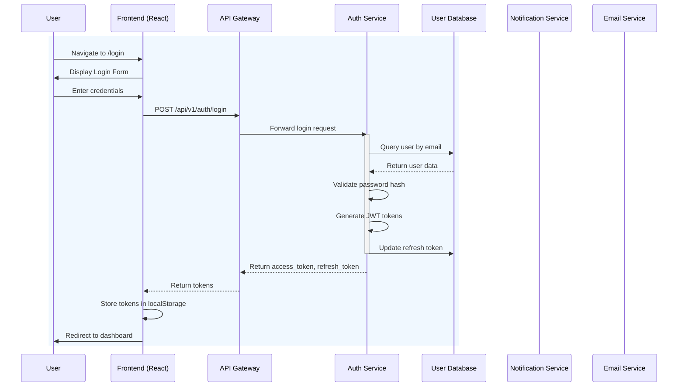
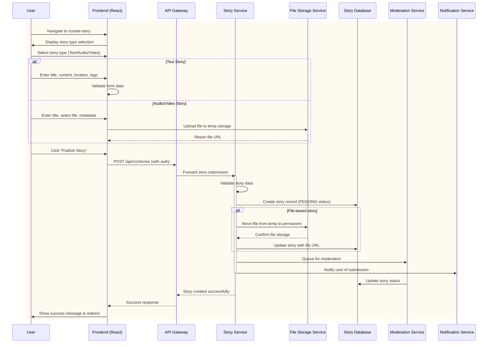
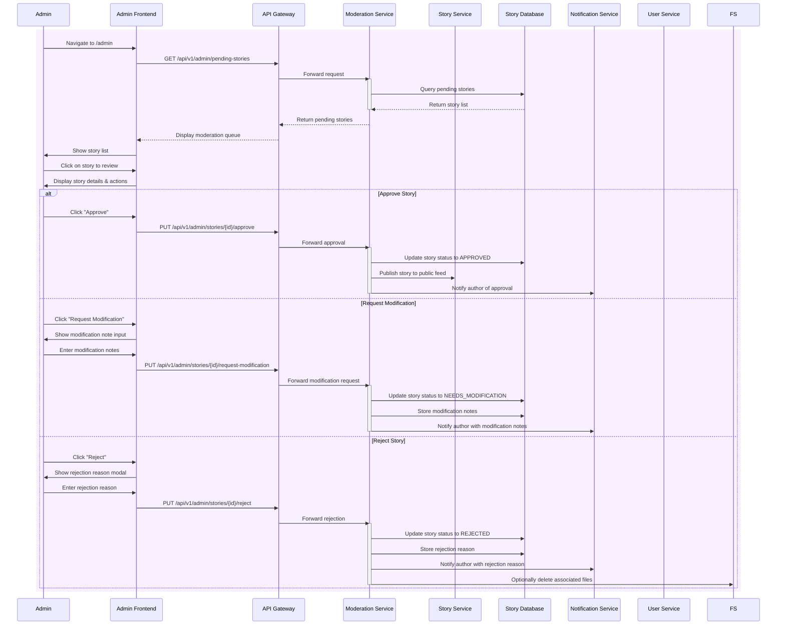
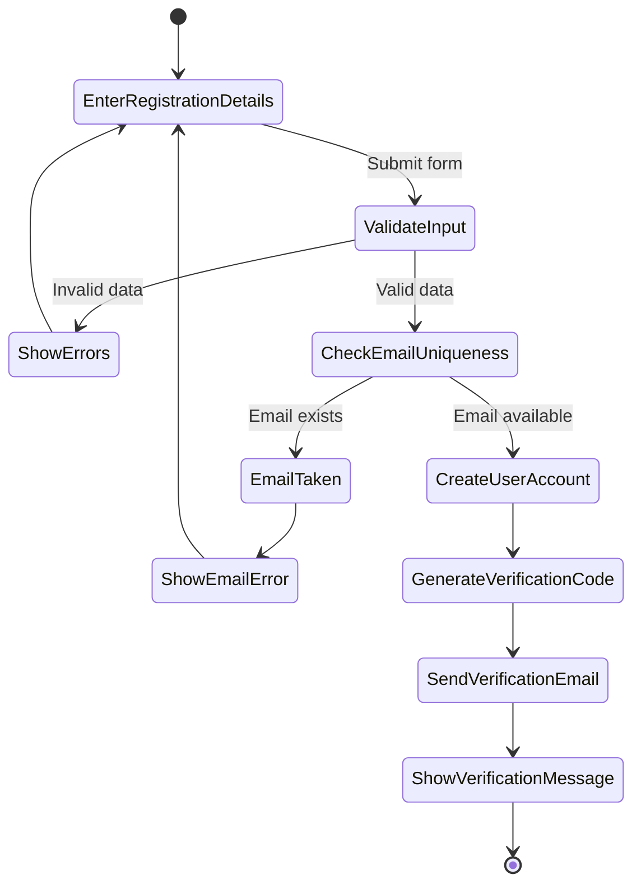
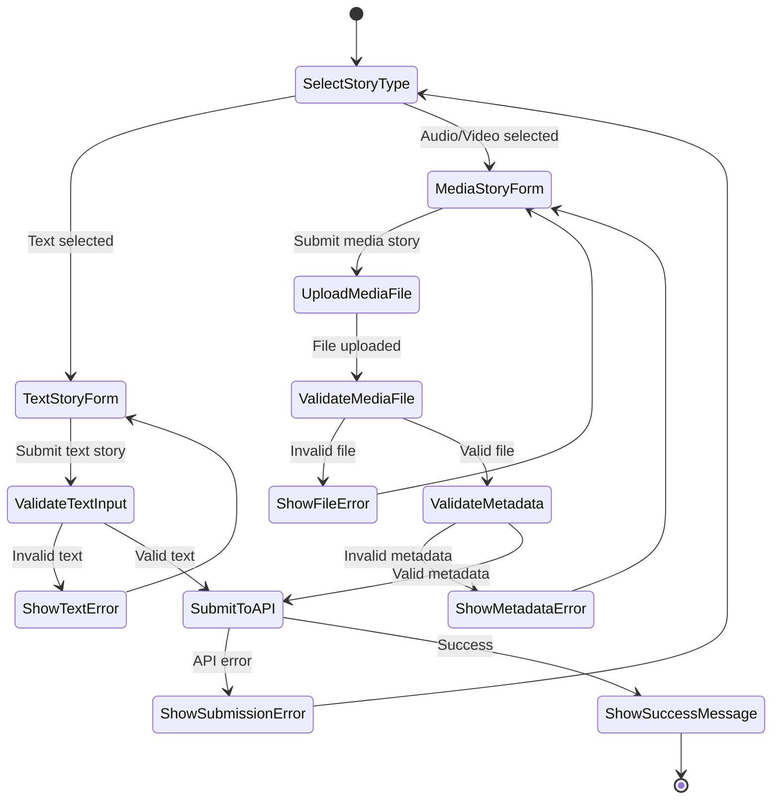
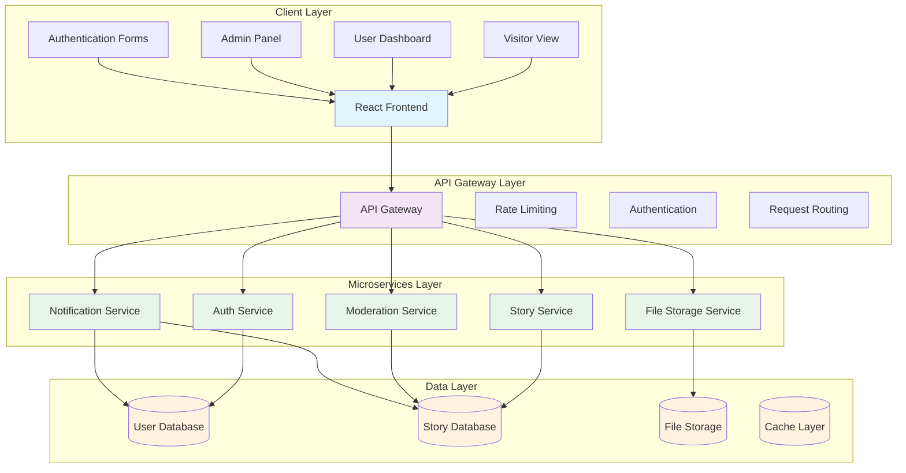

```mermaid
sequenceDiagram
    participant U as User
    participant FE as Frontend (React)
    participant AG as API Gateway
    participant AS as Auth Service
    participant DB as User Database
    participant NS as Notification Service
    participant ES as Email Service

    rect rgb(240, 248, 255)
        U->>FE: Navigate to /login
        FE->>U: Display Login Form
        U->>FE: Enter credentials
        FE->>AG: POST /api/v1/auth/login
        AG->>AS: Forward login request

        activate AS
            AS->>DB: Query user by email
            DB-->>AS: Return user data
            AS->>AS: Validate password hash
            AS->>AS: Generate JWT tokens
            AS->>DB: Update refresh token
        deactivate AS

        AS-->>AG: Return access_token, refresh_token
        AG-->>FE: Return tokens
        FE->>FE: Store tokens in localStorage
        FE->>U: Redirect to dashboard
    end
```

```mermaid
sequenceDiagram
    participant U as User
    participant FE as Frontend (React)
    participant AG as API Gateway
    participant SS as Story Service
    participant FS as File Storage Service
    participant DB as Story Database
    participant MS as Moderation Service
    participant NS as Notification Service

    rect rgb(255, 250, 240)
        U->>FE: Navigate to /create-story
        FE->>U: Display story type selection
        U->>FE: Select story type (Text/Audio/Video)

        alt Text Story
            U->>FE: Enter title, content, location, tags
            FE->>FE: Validate form data
        else Audio/Video Story
            U->>FE: Enter title, select file, metadata
            FE->>FS: Upload file to temp storage
            FS-->>FE: Return file URL
        end

        U->>FE: Click "Publish Story"
        FE->>AG: POST /api/v1/stories (with auth)
        AG->>SS: Forward story submission

        activate SS
            SS->>SS: Validate story data
            SS->>DB: Create story record (PENDING status)

            alt File-based story
                SS->>FS: Move file from temp to permanent
                FS-->>SS: Confirm file storage
                SS->>DB: Update story with file URL
            end

            SS->>MS: Queue for moderation
            SS->>NS: Notify user of submission
        deactivate SS

        MS->>DB: Update story status
        SS-->>AG: Story created successfully
        AG-->>FE: Success response
        FE->>U: Show success message & redirect
    end
```

```mermaid
sequenceDiagram
    participant A as Admin
    participant FE as Admin Frontend
    participant AG as API Gateway
    participant MS as Moderation Service
    participant SS as Story Service
    participant DB as Story Database
    participant NS as Notification Service
    participant US as User Service

    rect rgb(248, 240, 255)
        A->>FE: Navigate to /admin
        FE->>AG: GET /api/v1/admin/pending-stories
        AG->>MS: Forward request

        activate MS
            MS->>DB: Query pending stories
            DB-->>MS: Return story list
        deactivate MS

        MS-->>AG: Return pending stories
        AG-->>FE: Display moderation queue
        FE->>A: Show story list

        A->>FE: Click on story to review
        FE->>A: Display story details & actions

        alt Approve Story
            A->>FE: Click "Approve"
            FE->>AG: PUT /api/v1/admin/stories/{id}/approve
            AG->>MS: Forward approval

            activate MS
                MS->>DB: Update story status to APPROVED
                MS->>SS: Publish story to public feed
                MS->>NS: Notify author of approval
            deactivate MS

        else Request Modification
            A->>FE: Click "Request Modification"
            FE->>A: Show modification note input
            A->>FE: Enter modification notes
            FE->>AG: PUT /api/v1/admin/stories/{id}/request-modification
            AG->>MS: Forward modification request

            activate MS
                MS->>DB: Update story status to NEEDS_MODIFICATION
                MS->>DB: Store modification notes
                MS->>NS: Notify author with modification notes
            deactivate MS

        else Reject Story
            A->>FE: Click "Reject"
            FE->>A: Show rejection reason modal
            A->>FE: Enter rejection reason
            FE->>AG: PUT /api/v1/admin/stories/{id}/reject
            AG->>MS: Forward rejection

            activate MS
                MS->>DB: Update story status to REJECTED
                MS->>DB: Store rejection reason
                MS->>NS: Notify author with rejection reason
                MS->>FS: Optionally delete associated files
            deactivate MS
        end
    end
```

```mermaid
stateDiagram-v2
    [*] --> EnterRegistrationDetails
    EnterRegistrationDetails --> ValidateInput: Submit form

    ValidateInput --> ShowErrors: Invalid data
    ShowErrors --> EnterRegistrationDetails

    ValidateInput --> CheckEmailUniqueness: Valid data
    CheckEmailUniqueness --> EmailTaken: Email exists
    EmailTaken --> ShowEmailError
    ShowEmailError --> EnterRegistrationDetails

    CheckEmailUniqueness --> CreateUserAccount: Email available
    CreateUserAccount --> GenerateVerificationCode
    GenerateVerificationCode --> SendVerificationEmail
    SendVerificationEmail --> ShowVerificationMessage
    ShowVerificationMessage --> [*]
```

```mermaid
stateDiagram-v2
    [*] --> SelectStoryType
    SelectStoryType --> TextStoryForm: Text selected
    SelectStoryType --> MediaStoryForm: Audio/Video selected

    TextStoryForm --> ValidateTextInput: Submit text story
    MediaStoryForm --> UploadMediaFile: Submit media story

    UploadMediaFile --> ValidateMediaFile: File uploaded
    ValidateMediaFile --> ShowFileError: Invalid file
    ShowFileError --> MediaStoryForm

    ValidateMediaFile --> ValidateMetadata: Valid file
    ValidateMetadata --> ShowMetadataError: Invalid metadata
    ShowMetadataError --> MediaStoryForm

    ValidateTextInput --> ShowTextError: Invalid text
    ShowTextError --> TextStoryForm

    ValidateTextInput --> SubmitToAPI: Valid text
    ValidateMetadata --> SubmitToAPI: Valid metadata

    SubmitToAPI --> ShowSubmissionError: API error
    ShowSubmissionError --> SelectStoryType

    SubmitToAPI --> ShowSuccessMessage: Success
    ShowSuccessMessage --> [*]
```

```mermaid
graph TB
    subgraph "Client Layer"
        A[React Frontend]
        A1[Visitor View]
        A2[User Dashboard]
        A3[Admin Panel]
        A4[Authentication Forms]
    end

    subgraph "API Gateway Layer"
        B[API Gateway]
        B1[Rate Limiting]
        B2[Authentication]
        B3[Request Routing]
    end

    subgraph "Microservices Layer"
        C[Auth Service]
        D[Story Service]
        E[Moderation Service]
        F[Notification Service]
        G[File Storage Service]
    end

    subgraph "Data Layer"
        H[(User Database)]
        I[(Story Database)]
        J[(File Storage)]
        K[(Cache Layer)]
    end

    A --> B
    A1 --> A
    A2 --> A
    A3 --> A
    A4 --> A

    B --> C
    B --> D
    B --> E
    B --> F
    B --> G

    C --> H
    D --> I
    E --> I
    F --> H
    F --> I
    G --> J

    style A fill:#e1f5fe
    style B fill:#f3e5f5
    style C fill:#e8f5e8
    style D fill:#e8f5e8
    style E fill:#e8f5e8
    style F fill:#e8f5e8
    style G fill:#e8f5e8
    style H fill:#fff3e0
    style I fill:#fff3e0
    style J fill:#fff3e0
    style K fill:#fff3e0
```